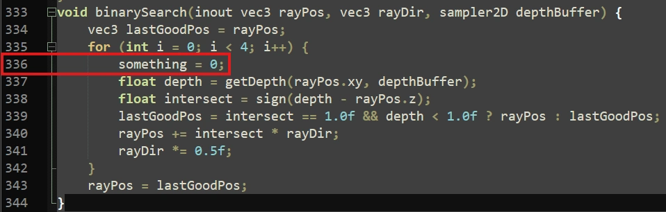

# Debug Mode
In debug mode, Iris will display any shader compilation errors directly. Debug mode can be enabled by pressing `ctrl`+`D` and restarting the game.

:::caution[Warning]
The 'Use no error context' setting will prevent the game from loading on some AMD drivers if debug mode is enabled. If you recieve a GLFW error when trying to load the game after enabling debug mode, you can disable the setting by editing `.minecraft/config/sodium-otions.json` and setting the value of `use_no_error_g_l_context` to `false`.
:::

# Finding Compilation Errors
Iris does not have proper support for line numbers in error messages. Line numbers in error messages correspond to the patched version of your shader code, which will not necessarily line up with the line numbers in your original code, especially if you have made use of the `#include` directive. The patched shader output can be found in the `.minecraft/patched_shaders`. Here's an example.


In this error message, we can see that the error occurs on line 336 of `deferred2.fsh`.


Opening `.minecraft/patched_shaders/005_deferred2.fsh` and navigating to line 336, we can see the line causing the error. Using the surrounding context, and perhaps the find+replace option in your text editor/IDE, you should be able to find the offending line.

# Attaching a Debugger
Graphics debuggers are very useful when developing shaders, as they can be used to inspect the state of the GPU at a certain point in the pipeline, and gather detailed performance metrics.

## RenderDoc
[RenderDoc](https://renderdoc.org/) is an open source and cross platform graphics debugging tool. The method for hooking it into the game is operating system dependent.

### Windows
The [Nsight and RenderDoc loader](https://modrinth.com/mod/nsight-loader) mod can be used to inject RenderDoc into the game on Windows. Simply select RenderDoc in the popup that appears when the game launches, and within RenderDoc, select `File`>`Attach to Running Instance` and select the game. It will likely appear as `javaw`.

If the mod is not available for your version of the game, you can use process injection to hook into the game. Navigate to `Tools`>`Settings` and enable `Enable process injection (restart required)`, then restart the application.

You can then select `File`>`Inject into Process`. Start the game, quickly search for `java` in the list, and press `Refresh`. Select the game, and press `Inject`.

:::caution[Warning]
Process injection must happen before Minecraft initialises OpenGL. You need to be quick!
:::

### Linux
On Linux, the game must be made to initialise RenderDoc by itself. This can be done by setting the `LD_PRELOAD` environment variable to the path to `librenderdoc.so`. This can commonly be found at `/usr/lib64/renderdoc/librenderdoc.so`, but you can find the exact path with the below command.


```bash title="Finding librenderdoc.so"
$ find / -type f -name "librenderdoc.so" 2>/dev/null
```

The method for setting the value of the environment variable is launcher dependent. In [Prism Launcher](https://prismlauncher.org/), the option can be found in the `Settings` tab when editing an instance.

:::caution[Warning]
The launcher you are using *must* have permission to access the `librenderdoc.so` file. Applications running in a sandboxed environment like Flatpak do not have general filesystem access by default.
:::

## Nsight
[Nsight](https://developer.nvidia.com/nsight-graphics) is an NVIDIA exclusive graphics debugger. It can provide much more detailed performance statistics.

The [Nsight and RenderDoc loader](https://modrinth.com/mod/nsight-loader) mod can be used to inject Nsight into the game.

Alternatively, you can launch your launcher of choice from within Nsight by pointing it to the launcher executable, and it should automatically hook into Minecraft.
